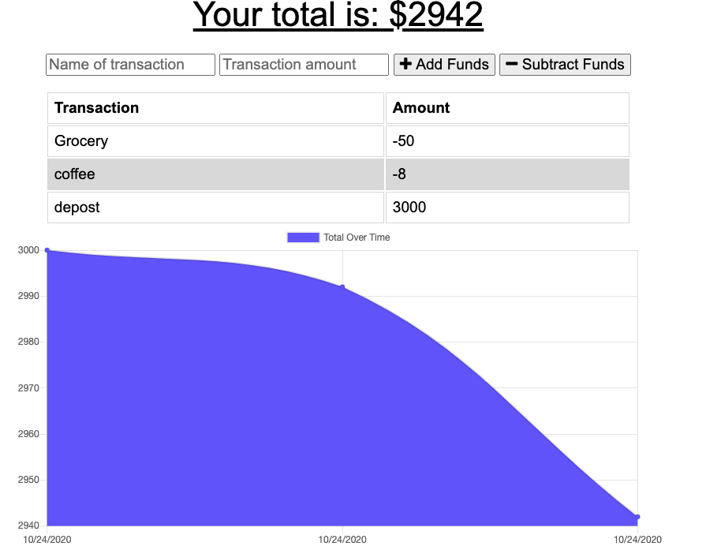

# Online-Offline_Budget_Tracker

This Budget Tracker application allows offline access and functionality.

The user will be able to add expenses and deposits to their budget with or without a connection. When entering transactions offline, they should populate the total when brought back online.

Offline Functionality:

  * Enter deposits offline

  * Enter expenses offline

When brought back online:

  * Offline entries should be added to tracker.

## Technology
* Web App Manifest
* Service Worker
* NoSQL
* MongoDB
* MongoDB Atlas
* Node.js

## Screenshot

## Link to Deployed Site

* https://stormy-ravine-99046.herokuapp.com/